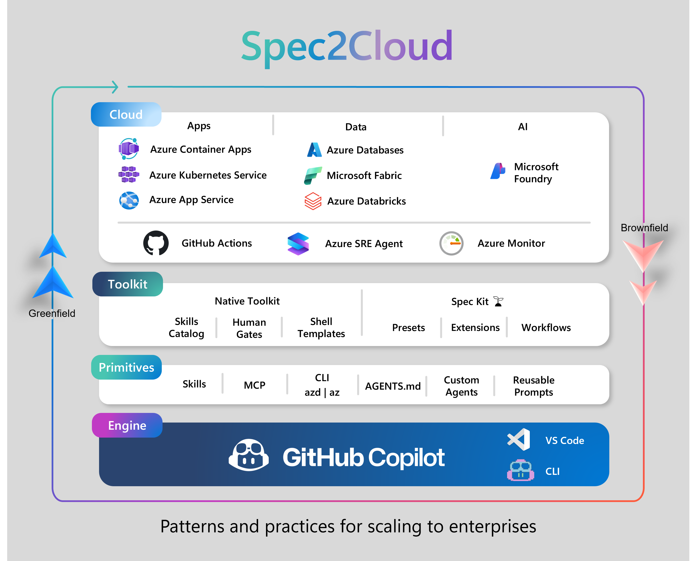

# Spec2Cloud

**Accelerate your Azure development with production-ready templates**


Spec2Cloud is a curated catalog of production-ready templates designed to help developers quickly build and deploy Azure applications. Whether you're building AI agents, modernizing applications, or creating data-centric solutions, Spec2Cloud provides the templates and tools to get you started faster.



---

## 🚀 Quick Start

Spec2Cloud offers multiple ways to discover and use templates, depending on your preferred workflow:

### 🌐 Web Experience

Browse the complete catalog of templates with an intuitive web interface.

**Access:** <http://aka.ms/spec2cloud>

**Quick Start:**
1. Visit <http://aka.ms/spec2cloud>
2. Browse templates by category, industry, or technology
3. Use filters to find templates matching your stack (services, languages, frameworks)
4. Click on a template to view details, watch demos, and see requirements
5. Click **"Use in"** and choose your preferred option:
   - **Open in VS Code** - Download directly to your local workspace
   - **GitHub Codespaces** - Launch in a cloud development environment
   - **vscode.dev** - Open in VS Code for the Web
   - **Clone** - Copy the git clone command

**Features:**
- 🔍 Advanced search and filtering
- 📺 Video demonstrations
- 🏷️ Tag-based discovery
- ⭐ GitHub stars and activity tracking
- 📱 Mobile-friendly interface

---

### 🔧 VS Code Extension

Install the Spec2Cloud Toolkit extension for an integrated template experience directly in Visual Studio Code.

**Install:** [Spec2Cloud Toolkit Extension](https://marketplace.visualstudio.com/items?itemName=ms-gbb-tools.spec2cloud-toolkit)

**Quick Start:**

1. **Install the extension:**
   - Open VS Code
   - Go to Extensions (Ctrl+Shift+X / Cmd+Shift+X)
   - Search for "Spec2Cloud Toolkit"
   - Click **Install**

2. **Browse templates:**
   - Open the Command Palette (Ctrl+Shift+P / Cmd+Shift+P)
   - Type `Spec2Cloud: Browse Templates`
   - Browse the catalog within VS Code

3. **Use a template:**
   - Select a template
   - Click **"Download to Workspace"**
   - The template will be cloned to your current workspace
   - Follow the template's README for setup instructions

**Features:**
- 📦 Download templates directly to your workspace
- 🔄 Stay up-to-date with the latest templates
- 🎯 IntelliSense and validation for template metadata
- 📝 Built-in template creation tools

---

### 💻 CLI Experience (Coming Soon)

A command-line interface for developers who prefer terminal-based workflows.

**Planned Features:**
- List and search templates from the terminal
- Clone templates with a single command
- Generate new templates from scaffolding
- Automate template deployment workflows

**Preview:**
```bash
```

Stay tuned for the CLI release!

---

## 📚 Template Categories

### 🤖 AI Apps & Agents
Build intelligent applications with Azure AI services, including chatbots, agents, and AI-powered workflows.

### 🔄 App Modernization
Migrate and modernize existing applications to Azure with cloud-native architectures and best practices.

### 📊 Data Centric Apps
Create data-driven applications leveraging Azure data services like Cosmos DB, SQL, and analytics platforms.

### ⚙️ Agentic DevOps
Implement automated DevOps workflows with AI-powered agents for CI/CD, monitoring, and infrastructure management.

---

## 🛠️ Creating Your Own Templates

Want to contribute your own template to Spec2Cloud? Follow these resources:

### Documentation
- **[Template Guidelines](https://github.com/EmeaAppGbb/spec2cloud)** - Learn the structure and requirements for creating Spec2Cloud templates
- **[Template Reference](https://github.com/EmeaAppGbb/spec2cloud)** - Use the template scaffold as a starting point

### Template Structure

Every Spec2Cloud template includes:

1. **SPEC2CLOUD.md** - Metadata file with YAML front matter containing:
   - Title, description, category, and industry
   - Authors and repository information
   - Services, languages, frameworks, and tags
   - Optional: thumbnail, video, version

2. **.github folder** - GitHub Copilot files with agents, prompts, etc.

3. **Specs** - .md files with the specs

### Metadata Requirements

**Mandatory Fields:**
- `title` - Template name (max 40 characters)
- `description` - Brief summary (max 140 characters)
- `category` - AI Apps & Agents | App Modernization | Data Centric Apps | Agentic DevOps
- `industry` - Target industry or "Cross-Industry"

**Optional Fields:**
- `authors` - GitHub usernames of contributors
- `services` - Azure services used
- `languages` - Programming languages
- `frameworks` - Frameworks and libraries
- `tags` - Additional categorization
- `thumbnail` - Preview image (16:9 aspect ratio)
- `video` - Demo video URL
- `version` - Semantic version number

### Example SPEC2CLOUD.md

```yaml
---
title: Marketing Agents
description: Generate and manage comprehensive marketing campaigns using AI Agents
repo: https://github.com/EmeaAppGbb/marketing-agents
authors: [kostapetan]
category: AI Apps & Agents
industry: Cross-Industry
services: [Azure AI Foundry, Azure Cosmos DB]
languages: [.NET]
frameworks: [Microsoft Agent Framework, Aspire]
tags: [playwright, marketing, campaigns]
thumbnail: thumbnail.png
video: https://youtu.be/example
version: 1.0.0
---
```

---

## 🤝 Contributing

We welcome contributions! Here's how you can help:

- **Add Templates** - Share your Azure solutions with the community
- **Report Issues** - Found a bug or broken template? Let us know
- **Suggest Features** - Have ideas for improvements? We'd love to hear them
- **Provide Feedback** - Help us make Spec2Cloud better

Visit <https://github.com/Azure-Samples/Spec2Cloud/issues/new/choose> to open issues!

---

## 📄 License

This project is licensed under the MIT License - see the [LICENSE](LICENSE.md) file for details.

---

## 🔗 Links

- **Web Catalog:** <http://aka.ms/spec2cloud>
- **VS Code Extension:** <https://marketplace.visualstudio.com/items?itemName=ms-gbb-tools.spec2cloud-toolkit>
- **GitHub Repository:** <https://github.com/Azure-Samples/Spec2Cloud>
- **Template Guidelines:** [TEMPLATES.md](https://github.com/EmeaAppGbb/spec2cloud)

---

**Built with ❤️ by the GBB team**
