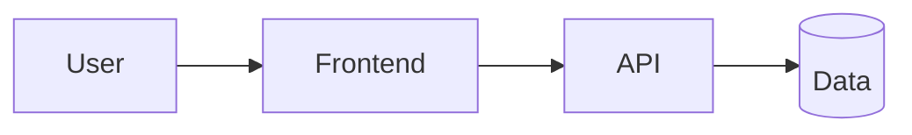

# {Project Name} — Specification

> **Last updated:** {YYYY-MM-DD}

## 1. Summary

One paragraph: what is being built, for whom, and why.

## 2. Goals & Non-Goals

**Goals**
- {measurable outcome}

**Non-Goals**
- {explicitly out of scope}

## 3. Users & Scenarios

| Persona | Scenario | Success Criteria |
| --- | --- | --- |
| {persona} | {scenario} | {observable outcome} |

## 4. Functional Requirements

List features as user-verifiable, testable statements. Use stable IDs.

| ID | Requirement | Priority |
| --- | --- | --- |
| FR-001 | The system MUST {action} so that {benefit}. | Must |
| FR-002 | {…} | Should |

## 5. Non-Functional Requirements

| Category | Requirement |
| --- | --- |
| Performance | e.g. p95 latency < 500 ms at 100 RPS |
| Availability | e.g. 99.9% monthly |
| Security | AuthN/AuthZ, data classification, secrets handling |
| Privacy & Compliance | e.g. GDPR, data residency |
| Scalability | expected load and growth |
| Observability | logs, metrics, traces |

## 6. Architecture Overview

Short description + a diagram (Mermaid). Components, data flow, trust boundaries.

## 7. Tech Stack

| Layer | Choice | Rationale |
| --- | --- | --- |
| Language(s) | e.g. TypeScript, Python | |
| Frontend framework | e.g. React + Vite | |
| Backend framework | e.g. FastAPI / ASP.NET / Express | |
| Data | e.g. Cosmos DB, PostgreSQL | |
| IaC | Bicep (default) / Terraform | |
| CI/CD | GitHub Actions + `azd` | |

## 8. Azure Services

| Service | Purpose | SKU/Tier | Notes |
| --- | --- | --- | --- |
| {e.g. Azure Container Apps} | Host API | Consumption | Managed identity |
| {e.g. Azure Storage} | Blob storage | Standard LRS | |
| {e.g. Key Vault} | Secrets | Standard | RBAC, no access policies |

## 9. AI / Foundry

*Optional — only if the solution uses AI.*

| Item | Choice | Rationale |
| --- | --- | --- |
| Foundry model(s) | e.g. `gpt-4o-mini` | cost/latency trade-off |
| Hosted agent(s) | name + protocol (responses/invocations) | |
| Framework | e.g. Microsoft Agent Framework | |
| Evaluation | metrics + datasets | |
| Guardrails | content safety, rate limits | |

## 10. Data Model

Key entities, fields, ownership, retention. Link to a schema file if large.

## 11. Interfaces

- **Public APIs** — endpoints, auth, request/response shape.
- **External integrations** — third-party services, webhooks.
- **Events** — topics/queues, schemas.

## 12. Open Questions

Mark unknowns inline as `[NEEDS CLARIFICATION: <question>]`; track resolution here.

| # | Question | Owner | Status |
| --- | --- | --- | --- |
| 1 | {…} | | open |

> Identity, secrets, and deployment targets live in [.azure/deployment-plan.md](../../../../.azure/deployment-plan.md).
