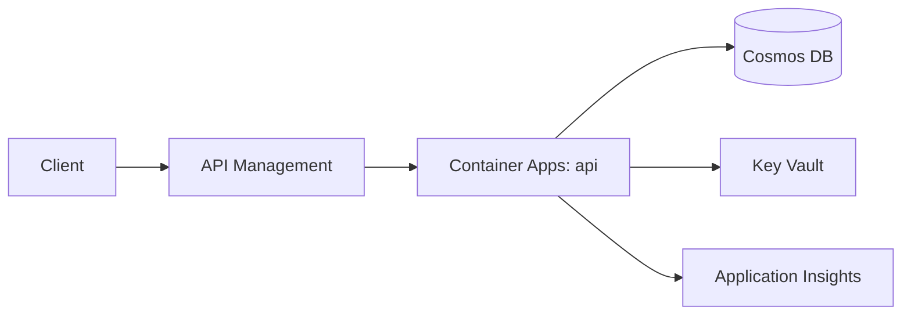

# Implementation Plan: [FEATURE]

**Input**: `specs/[###-feature]/spec.md` · **Constitution**: `.specify/memory/constitution.md`

> Generated/updated by `/speckit-plan`. Honor every constitution non-negotiable; if a request conflicts, surface it explicitly rather than silently overriding. Mark genuine unknowns with `[NEEDS CLARIFICATION: <question>]`. Don't restate the spec or enumerate individual tasks — those belong in `spec.md` and `tasks.md`.

## Summary

[One paragraph: feature in plain language + chosen approach in 1–2 sentences.]

## Technical context

- **Language / runtime**: [.NET 10, Node.js 24, Python 3.14 — or `[NEEDS CLARIFICATION: …]`]
- **Primary dependencies**: [frameworks, SDKs, libraries — or `[NEEDS CLARIFICATION: …]`]
- **Data stores**: [Cosmos DB (which API), Azure SQL, Storage (Blob/Table/Queue), Redis — or `N/A`]
- **External services**: [APIs / SaaS the feature depends on; failure modes if known]
- **Testing**: [unit / integration / load tooling]
- **Target platform**: [Linux container, Windows VM, browser, mobile, …]
- **Project type**: [api / web app / worker / cli / library / mobile]
- **Performance goals**: [e.g. p95 < 200 ms @ 100 RPS, cold start < 2 s]
- **Operational constraints**: [SLA, RTO/RPO, latency, offline, …]
- **Scale**: [users, requests/day, data volume, regions]

## Architecture

[One diagram or component list showing major pieces and how they interact. Reference the Azure services from the topology above.]



## Project structure

### Specs

```text
specs/[###-feature]/
├── plan.md          # This file
├── spec.md          # /speckit-specify output
├── tasks.md         # /speckit-tasks output (human)
├── tasks.json       # /speckit-tasks output (machine)
└── checklists/      # /speckit-checklist output (optional)
```

### Source layout

- **Follow the Azure Developer CLI project layout.** Keep infrastructure (Bicep / Terraform) under `/infra` and application code under `/src`, with `azure.yaml` at the workspace root wiring services to their source paths. Ensures `azd up`, `azd package`, and `azd provision` work out of the box.

## Risks & open questions

- [Risk] — mitigation
- `[NEEDS CLARIFICATION: <question>]`
