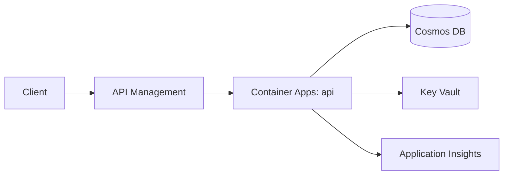

# Implementation Plan: [FEATURE]

**Input**: `specs/[###-feature]/spec.md` · **Constitution**: `.specify/memory/constitution.md`

> Generated/updated by `/speckit.plan`. Honor every constitution non-negotiable; if a request conflicts, surface it explicitly rather than silently overriding. Mark genuine unknowns with `[NEEDS CLARIFICATION: <question>]`. Don't restate the spec or enumerate individual tasks — those belong in `spec.md` and `tasks.md`.

## Summary

[One paragraph: feature in plain language + chosen approach in 1–2 sentences.]

## Technical context

- **Language / runtime**: [.NET 10, Node.js 24, Python 3.14 — or `[NEEDS CLARIFICATION: …]`]
- **Primary dependencies**: [frameworks, SDKs, libraries — or `[NEEDS CLARIFICATION: …]`]
- **Data stores**: [Cosmos DB (which API), Azure SQL, Storage (Blob/Table/Queue), Redis — or `N/A`]
- **External services**: [APIs / SaaS the feature depends on; failure modes if known]
- **Testing**: [unit / integration / load tooling]
- **Target platform**: [Linux container, Windows VM, browser, mobile, …]
- **Project type**: [api / web app / worker / cli / library / mobile]
- **Performance goals**: [e.g. p95 < 200 ms @ 100 RPS, cold start < 2 s]
- **Operational constraints**: [SLA, RTO/RPO, latency, offline, …]
- **Scale**: [users, requests/day, data volume, regions]

## Azure topology

> Required when the constitution sets Azure as the deployment target.

- **AI**: [Microsoft Foundry]
- **Compute**: [Container Apps (preferred) / App Service / Functions (Consumption|Flex) / AKS / VM — and why]
- **Data**: [Azure Database for PostgreSQL, Cosmos DB (account/db/containers), Azure SQL (tier), Storage (containers/queues), Redis tier]
- **Integration**: [Service Bus, Event Grid, API Management, Front Door / Application Gateway]
- **Identity**: [Microsoft Entra ID; managed identity scope; required RBAC role assignments]
- **Networking**: [public vs. private endpoints, VNet integration, egress strategy]
- **Secrets & config**: [Key Vault references; App Configuration; environment variables]
- **Observability**: [Application Insights / OpenTelemetry; Log Analytics workspace; required KQL queries / alerts]
- **Region(s)**: [primary / secondary; data-residency justification if applicable]
- **Environments**: `dev` → `staging` → `prod` [naming convention, subscription / RG split]
- **Cost target**: [estimated monthly spend per env + chosen SKU justification]

## Architecture

[One diagram or component list showing major pieces and how they interact. Reference the Azure services from the topology above.]



## Project structure

### Documentation

```text
specs/[###-feature]/
├── plan.md          # This file
├── spec.md          # /speckit.specify output
├── tasks.md         # /speckit.tasks output (human)
├── tasks.json       # /speckit.tasks output (machine)
└── checklists/      # /speckit.checklist output (optional)
```

### Source layout

Pick **one** option below and delete the rest. Replace placeholders with real paths.

```text
# Option A — single API / worker (DEFAULT for spec2cloud)
src/
├── api/             # HTTP entry points / triggers
├── domain/          # Pure domain logic
├── infra/           # Azure SDK wrappers (Cosmos, Storage, Service Bus, Key Vault)
└── lib/

infra/               # IaC entry point — see "Deployment" below
└── main.bicep       # or main.tf, or azure.yaml at repo root for azd

tests/
├── unit/
└── integration/
```

```text
# Option B — web app (frontend + backend)
backend/
├── src/{api,domain,infra}
└── tests/

frontend/
├── src/{components,pages,services}
└── tests/

infra/
```

```text
# Option C — multi-service (microservices / workers)
services/
├── <service-a>/{src,tests}
└── <service-b>/{src,tests}

shared/
infra/
```

**Structure decision**: [Name the chosen option and list the real top-level directories.]

## Design decisions

Each decision as **Decision → Rationale → Alternatives considered**. Cover at minimum: data model, public/internal contracts, async vs. sync flows, identity & RBAC, Azure topology choices that drove SKUs.

### D1. [Decision title]
- **Decision**: …
- **Rationale**: …
- **Alternatives considered**: …

### D2. [Decision title]
- **Decision**: …
- **Rationale**: …
- **Alternatives considered**: …

## Deployment

> Aligns with `/speckit.deploy` and the constitution's "Deployment is reproducible" rule.

- **IaC entry point** (preferred): [`azure.yaml` (azd) | `infra/main.bicep` (+ command) | `infra/main.tf`]
- **Imperative steps** (only if IaC support is missing or for spikes): [list exact `az` commands + parameters so the deploy can be replayed; otherwise `None`.]
- **Pre-flight**: [`az login` / `azd auth login`; required RBAC; required quotas]
- **Validation**: [`azd provision --preview` | `az deployment group what-if` | `terraform plan`]
- **Rollout**: [environment promotion order, blue/green or slots, smoke tests]
- **Rollback**: [how to revert — IaC re-apply of previous version, slot swap, manual `az` steps]

## Constitution check

*GATE: must pass before tasks. Re-check after design changes.* For each non-negotiable rule in `.specify/memory/constitution.md`, record **PASS** (how plan satisfies it), **N/A** (why it doesn't apply), or **VIOLATION** (describe + add a row to Complexity tracking).

| Rule | Status | Notes |
|------|--------|-------|
| Azure is the deployment target | PASS / N/A / VIOLATION | … |
| Secrets via Key Vault + managed identity | PASS / N/A / VIOLATION | … |
| Identity via Microsoft Entra ID | PASS / N/A / VIOLATION | … |
| Deployment is reproducible | PASS / N/A / VIOLATION | … |
| Production deploys are gated | PASS / N/A / VIOLATION | … |
| [project-specific rule] | … | … |

## Complexity tracking

> Fill **only** if the Constitution check has violations that must be justified. Unjustified violations block `/speckit.tasks`.

| Violation | Why needed | Simpler alternative rejected because |
|-----------|------------|--------------------------------------|
| [e.g. extra service tier] | [forced by SLA] | [serverless cold start exceeds budget] |

## Risks & open questions

- [Risk] — mitigation
- `[NEEDS CLARIFICATION: <question>]`
